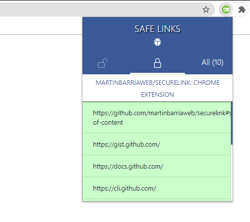
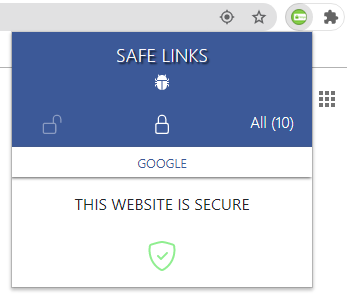
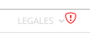

### :unlock: Safe Links :unlock:

All features created from scratch, without UI libraries.

### This is a UNPACKED Chrome Extension yet

##### :unlock: Unsafe Links!

##### :lock: Safe Links

##### :lock: Safe Pages

##### :lock: Automathic disabled Unsafe Links!

## Authors

- **Martin Barria Joost** - _Initial work_ - [GitHub](https://github.com/martinbarriaweb)

See also the list of [contributors](https://github.com/martinbarriaweb/securelink) who participated in this project.

## License

This project is licensed under the ISC License
